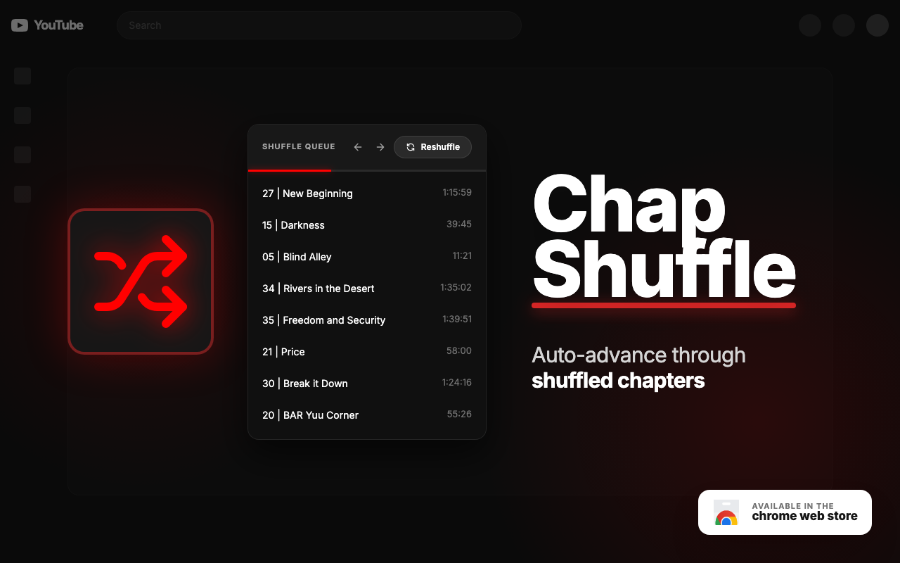

# Chap Shuffle

Shuffle YouTube video chapters for a randomized viewing experience.

Chap Shuffle adds chapter shuffle playback to YouTube videos. When a video has
chapters, you can play those chapters in a randomized order instead of watching
from start to finish.

Useful for music mixes, study sessions, compilations, ambient videos, and any
YouTube video where the chapters can stand on their own.

## Features

- Shuffle YouTube chapters with one click from the player
- View and jump through the shuffled chapter queue
- Move to the previous or next shuffled chapter
- Reshuffle the queue whenever you want
- Configure when Chap Shuffle appears and what happens when the queue ends
- Save settings with Chrome sync

Chap Shuffle only runs on YouTube and uses minimal permissions: YouTube page
access to read chapter data and Chrome storage to remember your settings.

## Releasing

1. Run the `Prepare Release` GitHub Actions workflow with version `X.Y.Z`.
2. Merge the generated `release/X.Y.Z` PR.
3. Run the `Publish Release` GitHub Actions workflow with version `X.Y.Z`.

`Publish Release` creates the `vX.Y.Z` tag from `main`, builds the release zip,
and creates the GitHub Release. It can also upload the zip to Chrome Web Store
without submitting it for review.

If you upload to Chrome Web Store, run `Submit Chrome Web Store` when you are
ready to submit the latest uploaded package for review.
